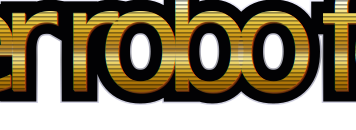
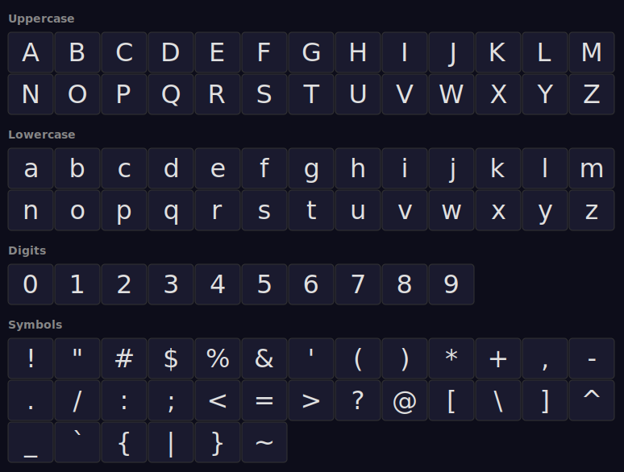

# RoboTacticsDisplay — Thin Italic



A display font in the spirit of popular mecha game title screens — bold angles,
thin italic strokes, and metallic styling reminiscent of classic tactical combat
franchises.

> **⚠️ Work in progress** — Letterforms are still in flux. Glyphs may change
> shape, spacing, or be added/removed between versions.

## Supported Lettering



## Installation

1. Copy `build/RoboTacticsDisplay-ThinItalic.ttf` to your system or project
   fonts directory.
2. Use font-family `"Robo Tactics Display"` with `font-style: italic` and
   `font-weight: 100`.

### Web / SVG embedding

The font can be embedded directly via base64 `@font-face` — see `logo.svg` or
run `scripts/generate_logo.py` for an example.

## Building from source

Requires [FontForge](https://fontforge.org/) with Python bindings:

```bash
python3 scripts/generate_font.py      # letters
python3 scripts/generate_symbols.py   # digits & symbols
```

Output lands in `build/`.

## Logo & glyph table generation

```bash
python3 scripts/generate_logo.py
python3 scripts/generate_glyphs.py
```

Produces `logo.svg` and `glyphs.svg` (both embed the font as base64).

## License

MIT No Attribution — free as-is. See [LICENSE](LICENSE).

Use it, modify it, ship it. No attribution required.
